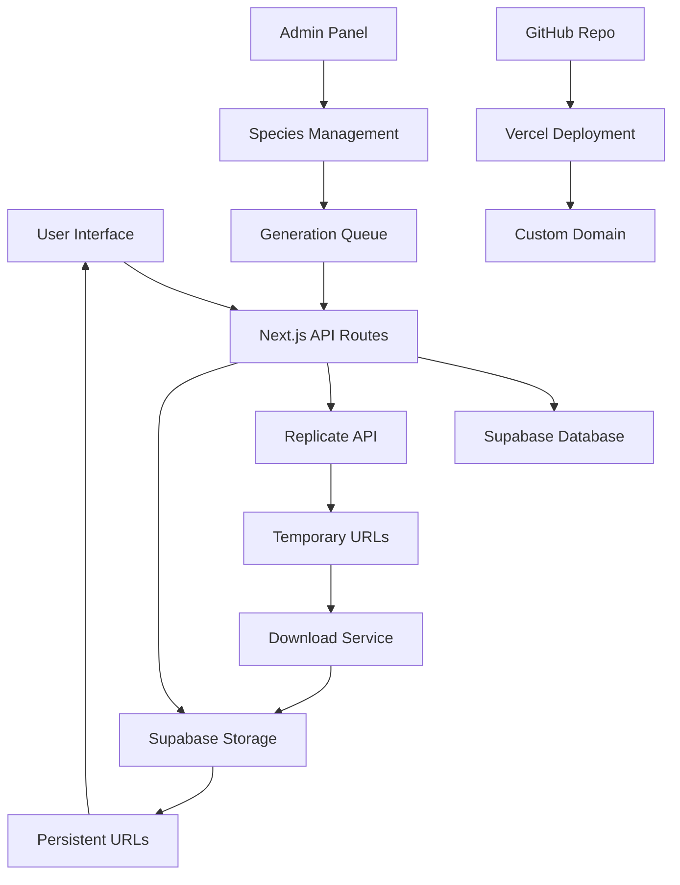

# Entity v1.0 - Production Deployment Plan

## Overview
This document outlines the comprehensive plan to take the Entity extinct species generator from local development to production deployment with persistent media storage, GitHub integration, and enhanced user experience.

## Current State Analysis

### ✅ Working Features
- Next.js 15 with TypeScript and Tailwind CSS
- Supabase database with real-time subscriptions
- Replicate API integration (SDXL images, Kling v1.6 videos)
- Admin panel with species management
- Automated 7-minute cycling system
- Gallery interface with species display

### ⚠️ Critical Issues
- **Media Persistence**: Replicate URLs are temporary and disappear on server restart
- **No Version Control**: Project not in GitHub repository
- **Local Only**: Not deployed for sharing with Craig
- **UX Limitations**: No download buttons, no landing page

## Implementation Phases

### Phase 1: Media Persistence (Critical Priority)
**Goal**: Ensure all generated media is permanently stored

1. **Set up Supabase Storage bucket for persistent media files**
   - Create `species-media` bucket in Supabase
   - Configure public access policies
   - Set up folder structure: `images/` and `videos/`

2. **Create media download and storage service**
   - Build service to download files from Replicate URLs
   - Upload to Supabase Storage with proper naming
   - Generate permanent public URLs

3. **Update database schema**
   - Add `supabase_image_path` and `supabase_video_path` columns
   - Maintain backward compatibility with existing URLs
   - Update TypeScript types

4. **Modify generation APIs**
   - Download and store files after Replicate generation
   - Update database with both Replicate and Supabase URLs
   - Add error handling for storage failures

### Phase 2: Repository & Collaboration
**Goal**: Enable version control and collaboration with Craig

5. **Create GitHub repository setup and initial commit**
   - Initialize Git repository
   - Create `.gitignore` for Next.js and environment files
   - Set up branch protection and collaboration settings
   - Document repository structure

### Phase 3: User Experience Enhancements
**Goal**: Improve interface for gallery and user interaction

6. **Add download buttons to gallery interface**
   - Add download buttons for images and videos
   - Implement client-side download functionality
   - Style buttons to match existing design

7. **Create landing page/splash screen**
   - Design professional entry point
   - Add project information and navigation
   - Implement smooth transition to gallery

### Phase 4: Production Deployment
**Goal**: Deploy to production with custom domain

8. **Set up environment variables for production**
   - Create production environment configuration
   - Secure API key management
   - Configure Supabase production settings

9. **Configure Vercel deployment with custom domain**
   - Connect GitHub repository to Vercel
   - Set up automatic deployments
   - Configure custom domain DNS
   - Set up SSL certificates

### Phase 5: Advanced Features
**Goal**: Add automation and enhanced functionality

10. **Add species loop automation and user choice features**
    - Implement manual species navigation
    - Add play/pause controls for automation
    - Create species selection interface

11. **Update Replicate API key management for Craig's access**
    - Switch to Craig's Replicate account
    - Update environment variables
    - Test generation with new credentials

### Phase 6: Production Readiness
**Goal**: Ensure reliability and maintainability

12. **Create production deployment checklist and documentation**
    - Document deployment process
    - Create troubleshooting guide
    - Set up backup procedures

13. **Set up monitoring and error handling for production**
    - Implement error tracking (Sentry or similar)
    - Add performance monitoring
    - Set up alerts for critical failures

14. **Test full deployment pipeline and media persistence**
    - End-to-end testing of generation and storage
    - Load testing for gallery interface
    - Verify all media persists across deployments

## Architecture Diagram

## Success Criteria

After completion, the system will have:

- 🎯 **Persistent Media**: All images and videos permanently stored
- 🤝 **Collaboration Ready**: GitHub repository for team access
- 📱 **Production Deployed**: Live website on custom domain
- 🔄 **Automated Operations**: Species cycling and generation
- 📊 **Admin Access**: Full management for Craig
- 🛡️ **Reliable Storage**: No media loss on restarts
- 🚀 **Scalable**: Ready for high traffic

## Timeline Estimate

- **Phase 1**: 2-3 hours (Critical - should be done first)
- **Phase 2**: 1 hour
- **Phase 3**: 2-3 hours
- **Phase 4**: 2-3 hours
- **Phase 5**: 2-3 hours
- **Phase 6**: 2-3 hours

**Total Estimated Time**: 11-16 hours

## Next Steps

1. Switch to **Code Mode** to begin implementation
2. Start with Phase 1 (Media Persistence) - most critical
3. Work through phases sequentially
4. Test thoroughly at each phase
5. Deploy to production once all phases complete

---

*This plan ensures a smooth transition from development to production while maintaining all existing functionality and adding critical improvements.*