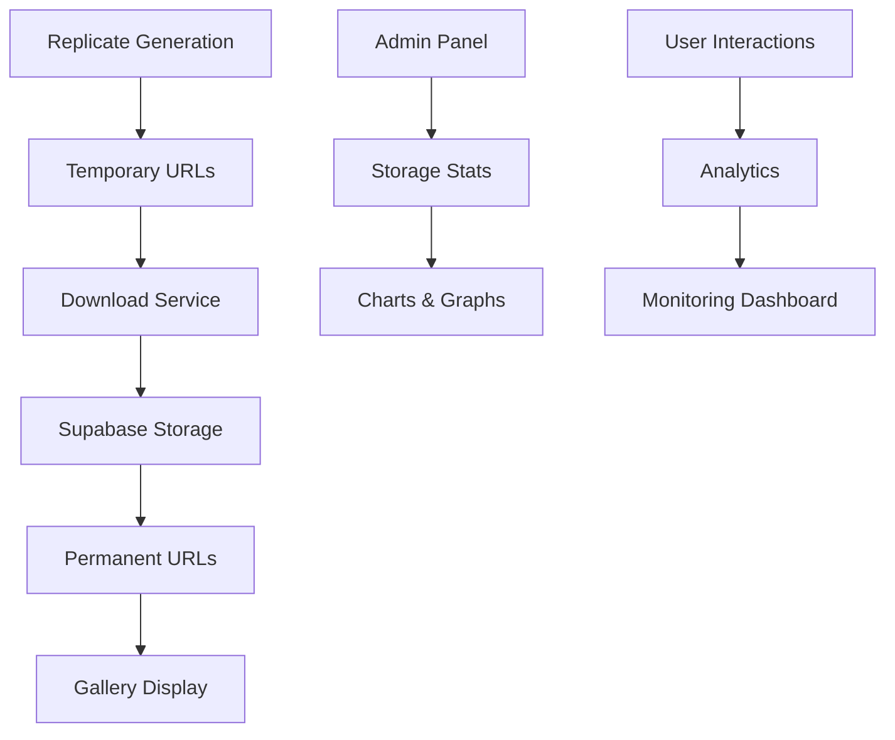

# Entity v1.0 - Production Readiness Plan
## Craig Collaboration & Art Show Deployment

### Overview
This document outlines the comprehensive plan to make Entity v1.0 production-ready for Craig's collaboration and the upcoming art show. The system is currently live at https://entity-gamma.vercel.app with core functionality implemented, but requires several enhancements for robust public deployment.

---

## Current System Status ✅

### What's Working
- ✅ **Live Deployment**: System deployed on Vercel at https://entity-gamma.vercel.app
- ✅ **Core Generation**: Image and video generation via Replicate APIs
- ✅ **Database**: Supabase PostgreSQL with real-time subscriptions
- ✅ **Media Storage Logic**: Code exists to download and store media in Supabase Storage
- ✅ **Admin Panel**: Basic admin interface with species management
- ✅ **Gallery Interface**: Species browsing and media display
- ✅ **Automated Cycling**: 7-minute species progression system

### Critical Issues to Address
- 🔧 **Media Persistence**: Images/videos disappear after browser restarts
- 🔧 **Storage Bucket**: Supabase Storage bucket may not be properly initialized
- 🔧 **Admin Navigation**: Gallery and species list links need verification
- 🔧 **Production Monitoring**: Need robust metrics and error tracking
- 🔧 **Art Show Features**: Missing looping mode and pre-generation workflow

---

## Phase 1: Core Stability & Media Persistence 🎯

### 1.1 Fix Supabase Storage Issues
**Priority: CRITICAL**
- Verify storage bucket initialization and permissions
- Test media download and storage pipeline
- Ensure gallery displays persistent URLs (supabase_image_url/supabase_video_url)
- Add fallback logic for failed storage operations

### 1.2 Admin Panel Navigation
**Priority: HIGH**
- Test all admin panel links (gallery, species list)
- Fix any broken navigation or API endpoints
- Ensure admin panel works consistently across browser sessions

### 1.3 Error Handling & Logging
**Priority: HIGH**
- Implement comprehensive error tracking
- Add production-grade logging with monitoring service
- Create error recovery mechanisms for failed generations

---

## Phase 2: Enhanced Admin & Monitoring 📊

### 2.1 Robust Admin Dashboard
**Features for Art Show Management:**
- **Real-time Metrics Dashboard**
  - Total species processed
  - Generation success/failure rates
  - Storage utilization statistics
  - Active user sessions (gallery visitors)
  - System performance metrics

- **Advanced Charts & Graphs**
  - Generation timeline visualization
  - Species completion progress bar
  - Error rate trends over time
  - Storage growth charts
  - User interaction heatmaps

- **Operational Controls**
  - Bulk pre-generation controls
  - Emergency stop/start functions
  - Manual species selection override
  - System health monitoring

### 2.2 Production Monitoring
- **Health Checks**: Database, Replicate API, Storage connectivity
- **Performance Metrics**: Response times, memory usage, error rates
- **Alerting System**: Email/webhook notifications for critical issues
- **Uptime Monitoring**: 24/7 system availability tracking

---

## Phase 3: Art Show Specific Features 🎨

### 3.1 Looping Mode Implementation
**Pre-Generation Workflow:**
- Batch generate all species images/videos before art show
- Create "exhibition mode" that cycles through completed content
- Implement manual override for visitor interactions
- Add "jukebox mode" - auto-play with manual selection capability

### 3.2 Gallery Enhancements
- **Download Functionality**: Allow visitors to download images/videos
- **QR Code Integration**: Generate and test QR codes for mobile access
- **Mobile Optimization**: Ensure perfect mobile experience
- **Interaction Tracking**: Analytics for visitor engagement

### 3.3 User Experience
- **Loading States**: Smooth transitions and progress indicators
- **Error Recovery**: Graceful handling of network issues
- **Accessibility**: Screen reader support and keyboard navigation
- **Performance**: Optimized loading for gallery environment

---

## Phase 4: Craig Collaboration Setup 🤝

### 4.1 API Key Management
- **Replicate Integration**: Test with Craig's API key
- **Environment Variables**: Secure key management in Vercel
- **Rate Limiting**: Implement proper API usage controls
- **Cost Monitoring**: Track generation costs and usage

### 4.2 Documentation & Onboarding
- **Admin Guide**: Complete admin panel documentation
- **Troubleshooting**: Common issues and solutions
- **API Documentation**: All endpoints and their usage
- **Deployment Guide**: How to deploy updates and manage the system

### 4.3 Collaboration Workflow
- **GitHub Access**: Repository permissions and branch protection
- **Development Environment**: Local setup instructions
- **Testing Procedures**: How to test changes before deployment
- **Emergency Procedures**: What to do if something breaks during the show

---

## Phase 5: Production Deployment & Backup 🛡️

### 5.1 Backup & Recovery
- **Database Backups**: Automated daily Supabase backups
- **Media Backups**: Supabase Storage backup procedures
- **Configuration Backups**: Environment variables and settings
- **Recovery Testing**: Verify backup restoration procedures

### 5.2 Security & Performance
- **Security Audit**: Review all API endpoints and permissions
- **Performance Optimization**: Image/video loading optimization
- **CDN Configuration**: Ensure fast global content delivery
- **SSL/HTTPS**: Verify secure connections throughout

### 5.3 Art Show Operational Procedures
- **Pre-Show Checklist**: Complete system verification
- **During Show Monitoring**: Real-time system oversight
- **Emergency Contacts**: Who to call if issues arise
- **Post-Show Analysis**: Performance and engagement metrics

---

## Technical Implementation Details

### Storage Architecture

### Key Metrics to Track
1. **Generation Metrics**
   - Images generated per hour
   - Videos generated per hour
   - Success/failure rates
   - Average generation time

2. **Storage Metrics**
   - Total files stored
   - Storage space used
   - Download bandwidth
   - File access patterns

3. **User Metrics**
   - Gallery visitors
   - Time spent viewing
   - Species popularity
   - Download activity

4. **System Metrics**
   - API response times
   - Database query performance
   - Error rates
   - Uptime percentage

---

## Timeline & Priorities

### Week 1: Core Stability
- [ ] Fix media persistence issues
- [ ] Verify admin panel functionality
- [ ] Implement basic monitoring

### Week 2: Enhanced Features
- [ ] Add robust admin dashboard
- [ ] Implement looping mode
- [ ] Create comprehensive documentation

### Week 3: Production Polish
- [ ] Test with Craig's API key
- [ ] Set up backup procedures
- [ ] Create operational procedures

### Week 4: Art Show Preparation
- [ ] Pre-generate all content
- [ ] Final testing and optimization
- [ ] Deploy production configuration

---

## Success Criteria

By completion, the system will have:
- 🎯 **100% Media Persistence**: No content loss on restarts
- 🎯 **Robust Admin Interface**: Complete monitoring and control
- 🎯 **Art Show Ready**: Looping mode and visitor interaction
- 🎯 **Craig Collaboration**: Full access and documentation
- 🎯 **Production Stable**: 99.9% uptime with monitoring
- 🎯 **Visitor Optimized**: Perfect mobile and gallery experience

---

## Next Steps

1. **Switch to Code Mode** to begin implementation
2. **Start with Phase 1** - Critical media persistence fixes
3. **Test thoroughly** at each phase
4. **Document everything** for Craig's onboarding
5. **Prepare for art show** with pre-generated content

This plan ensures a smooth transition from development to production while maintaining all existing functionality and adding critical improvements for the art show deployment.